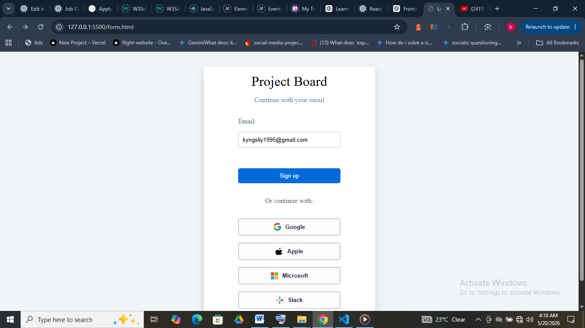

# Project Board

A Trello-inspired task management board built with Vanilla JavaScript, HTML, and CSS.

## Features

- Drag and drop task management
- LocalStorage persistence
- Dynamic card rendering
- Responsive layout
- Edit and delete functionality
- Sidebar and column organization
- Interactive popovers and menus

## Technologies Used

- HTML5
- CSS3
- JavaScript (Vanilla JS)
- LocalStorage API
- Lucide Icons
- Font Awesome

## Screenshots

### Login Page

### Main Board

## Live Demo

(Add GitHub Pages link here)

## What I Learned

This project helped me better understand:

- State-driven UI rendering
- DOM manipulation
- Event delegation
- Application orchestration
- Drag and drop behavior
- UI state management
- Local persistence with localStorage

## Possible Future Improvements

- Convert project into React
- Add backend/database persistence
- Authentication system
- Better accessibility
- Modular JavaScript structure
- Search and filtering improvements
